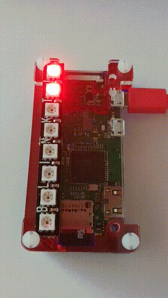

# trafficlight
build a traffic light with Raspberry Pi (Zero) and Pimoroni Blinkt! :vertical_traffic_light:

Just a simple example of what you can do with Pimoroni Blinkt! on top of the GPIO pins of Raspberry Pi (Zero). 

## how it looks like 

## Authors
* **Christian Becker** - [christian-becker](https://github.com/christian-becker)

## License
This project is licensed under the MIT License - see the [LICENSE](LICENSE) file for details.

